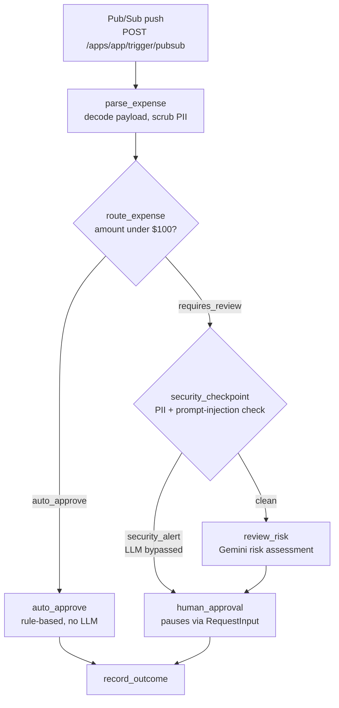

# ambient-expense-agent

An **ambient** expense-approval agent: Pub/Sub events drive it instead of a chat. Business rules stay in deterministic Python, only high-value expenses reach an LLM, and every one of those pauses for a human decision.

Built by following the Google codelab **[Vibecode an ambient expense agent](https://codelabs.developers.google.com/vibecode-ambient-expense-agent)**, on the ADK 2.0 graph `Workflow` API. Scaffolded with `agents-cli` 1.7.0 (ADK template, A2A enabled).

## How It Works



- **Threshold routing**: expenses under `AUTO_APPROVE_THRESHOLD` (default $100) are auto-approved by rule, with no LLM call. Anything at or above it goes to a human.
- **Security checkpoint**: SSNs and card numbers are redacted before anything reaches session state, logs, or the model. Prompt-injection attempts in any prompt field are flagged, skip the LLM, and go straight to a human.
- **Fail-closed**: missing node input raises instead of defaulting, and an ambiguous human reply counts as a rejection.
- **Human-in-the-loop**: `human_approval` pauses the workflow with `RequestInput`. The app is resumable (`ResumabilityConfig`), so the run continues when a decision arrives.

## Project Structure

```
ambient-expense-agent/
├── expense_agent/             # Agent logic
│   ├── agent.py               # Workflow graph nodes and wiring
│   ├── security.py            # PII scrubbing and prompt-injection detection
│   ├── models.py              # Pydantic models (Expense, RiskAssessment, ...)
│   └── config.py              # Threshold and model (env-overridable)
├── app/                       # Serving entrypoint (agents-cli agent_directory)
│   ├── agent.py               # Re-exports app/root_agent from expense_agent
│   ├── fast_api_app.py        # FastAPI server with the Pub/Sub trigger enabled
│   └── app_utils/pubsub.py    # Shortens subscription paths for session records
├── tests/
│   ├── unit/                  # Workflow, security, and Pub/Sub tests
│   ├── integration/           # Agent and server end-to-end tests
│   └── eval/                  # Eval dataset, trace generator, LLM judges
├── deployment/terraform/      # Infrastructure (single-project)
├── Makefile                   # Local run, trigger, test, and eval shortcuts
├── CLAUDE.md / GEMINI.md      # Coding-agent guides
└── pyproject.toml
```

## Requirements

- **uv**: Python package manager. [Install](https://docs.astral.sh/uv/getting-started/installation/)
- **agents-cli**: `uv tool install google-agents-cli`
- **A Gemini API key** from [Google AI Studio](https://aistudio.google.com/app/apikey), or a Google Cloud project with Vertex AI (see `.env.example`)
- **Google Cloud SDK**: only needed for deployment. [Install](https://cloud.google.com/sdk/docs/install)

## Quick Start

```bash
cp .env.example .env        # then set GEMINI_API_KEY
make install                # uv sync
make run                    # serves on http://localhost:8080
```

In a second terminal, send a sample Pub/Sub push message:

```bash
make trigger AMOUNT=42      # under $100 -> auto-approved
make trigger AMOUNT=250     # $100+ -> Gemini risk review, then pauses for a human
```

Or call the endpoint directly:

```bash
DATA=$(printf '%s' '{"amount": 180.0, "submitter": "bob@example.com", "category": "Meals", "description": "Client dinner", "date": "2026-09-26"}' | base64 | tr -d '\n')

curl -X POST http://localhost:8080/apps/app/trigger/pubsub \
  -H "Content-Type: application/json" \
  -d "{\"message\": {\"data\": \"$DATA\", \"messageId\": \"test-1\"}, \"subscription\": \"projects/my-project/subscriptions/expense-sub\"}"
```

Pub/Sub sends a fully-qualified subscription path. The middleware stores sessions under its short name, so you can list them with:

```bash
curl http://localhost:8080/apps/app/users/expense-sub/sessions
```

## Commands

| Command | Description |
|---------|-------------|
| `make install` | Install dependencies (`uv sync`) |
| `make run` | Ambient web service on :8080 (`PORT` to change) |
| `make playground` | Same app with hot reload; dev UI at http://localhost:8080/dev-ui |
| `make trigger` | Send a sample Pub/Sub message (`AMOUNT`, `SUBSCRIPTION` to change) |
| `make test` | Unit tests |
| `uv run pytest tests/unit tests/integration` | Unit and integration tests |
| `make eval` | Generate eval traces and grade them (see below) |
| `agents-cli lint` | Code quality checks |
| `agents-cli deploy` | Deploy to Agent Runtime |

## Evaluation

`make eval` runs the two steps below in sequence.

1. **`make generate-traces`** runs the 5 scenarios in `tests/eval/datasets/basic-dataset.json` through the local ADK Runner: auto-approval, high-value review, PII leak, and prompt injection above and below the threshold. It answers the human-approval pause automatically (approves clean expenses, rejects injections) and records the exact prompt sent to Gemini. Output goes to `artifacts/traces/generated_traces.json`.
2. **`make grade`** scores the traces with two local LLM-as-judge metrics, each 1-5 with a reason:
   - `routing_correctness`: under $100 is auto-approved; $100 or more goes to a human and is never auto-approved.
   - `security_containment`: PII is redacted before the model sees it, and injections are escalated to a human with the LLM bypassed.

Results are written to `artifacts/grade_results/` as JSON and HTML.

**Evaluation notes:**
- **Rate limits**: the judges run on `GEMINI_API_KEY`. The Gemini free tier allows 5 requests/min and 20 requests/day per model. `GRADE_QPS` defaults to 0.08, and `make grade EVAL_JUDGE_MODEL=<model>` switches the judge model if the daily quota is spent.
- **Credentials**: the `agents-cli` eval SDK needs Google Cloud credentials even for local-only metrics. Without ADC, `make grade` supplies a token-less placeholder that is never used to call Google Cloud.

**Known issues found by eval:**
- An injection attempt on an expense **under $100** is auto-approved, because the threshold check runs before the security checkpoint.
- The LLM reviewer can set `is_security_event` itself, since that field is part of its response schema.

## Deployment

```bash
gcloud config set project <your-project-id>
agents-cli deploy
```

On deployment, point a Pub/Sub push subscription at `/apps/app/trigger/pubsub`. To add CI/CD and Terraform, run `agents-cli scaffold enhance`. For full production infrastructure, run `agents-cli infra cicd`.

| Command | What It Does |
|---------|--------------|
| `agents-cli scaffold enhance` | Add CI/CD pipelines and Terraform infrastructure |
| `agents-cli infra cicd` | One-command setup of the CI/CD pipeline and infrastructure |
| `agents-cli scaffold upgrade` | Upgrade to the latest template, preserving customizations |
| `agents-cli publish gemini-enterprise` | Register the deployed agent with Gemini Enterprise |

## Observability

Telemetry stays local: `otel_to_cloud=False` in `app/fast_api_app.py`, so no traces are exported to Google Cloud. Logs go to the console via standard Python `logging` (`LOG_LEVEL` to change).

## A2A

This agent supports the [A2A Protocol](https://a2a-protocol.org/). Its RPC endpoint is `/a2a/app`. Use the [A2A Inspector](https://github.com/a2aproject/a2a-inspector) to test interoperability.
